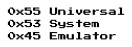

# USE: the Universal System Emulator
The USE is a platform created to ease the development of software-based emulators of archaic hardware.
The project aims to be easily understandable, extensible, portable and tries to follow good programming practices while
utilizing the newest C++ standard. For more information about the project, please consult the documentation.

Are you an user? Check user guide (TODO link).

Are you a developer? Check development guide (TODO link).

## Prebuilt binaries
TODO

## Quick start on Linux/macOS/Windows
This is a quick start guide on how to prepare the platform either for development of your own emulator or just testing.

Note that there are some required system packages (CMake will report), for Ubuntu they are: `libxrandr-dev libxinerama-dev libxcursor-dev libxi-dev libgl-dev`.

### Get the repository
```shell
git clone https://github.com/andreondra/use.git
```
### Configure the CMake project
```shell
cd use
mkdir build
cd build
cmake ..
cmake --build . -j 4 -t use
```

The CMake will download most of the dependecies, however, depending on your platform, there may be some other
libraries required. Please check the output of the `cmake ..` command. If there is any problem, do not hesitate
to open an Issue.

### Run the project
```shell
./use
```

### Building the docs
You can use a prebuilt documentation on GitHub pages, which is built from every commit to the main branch, or you
can build the documentation on your own. The process is the same as with building the executable except you
change the target:
- `-t docs` to build only autogenerated Doxygen API documentation.
- `-t sphinxdocs` to build a complete documentation including manuals with Sphinx and ReadTheDocs theme.

### Cross-compiling on Linux for Windows
On Fedora you follow the steps described above but instead of `cmake` use a script `mingw64-cmake`. That's it. This script should
be also available for Arch Linux.

On Ubuntu you need to use a special toolchain file. Add to the `cmake` commands this parameter: `-DCMAKE_TOOLCHAIN_FILE=../cmake_src/mingw-w64-x86_64.cmake`

## Contributing
You are always very welcome to file bug reports using Issues or opening PRs for enhancements.

## License
USE Copyright (C) 2023 Ondrej Golasowski

This project is licensed under the GNU GPLv3.
Full text of the license can be found in the `COPYING` file.
This license applies to all the files in this repository except:
- External projects downloaded during the CMake configuration step, these projects have their own license in their repository.
- Manually included projects. These projects contain their license in the directory.