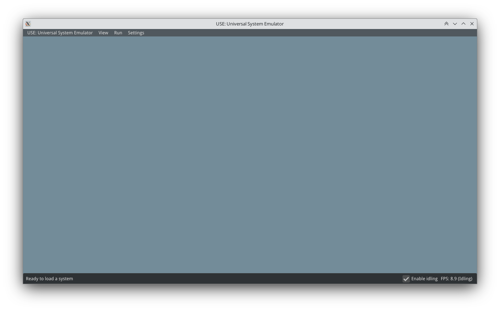
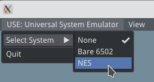
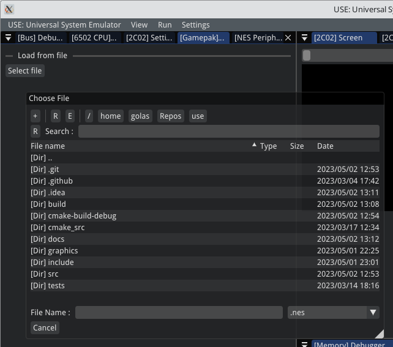
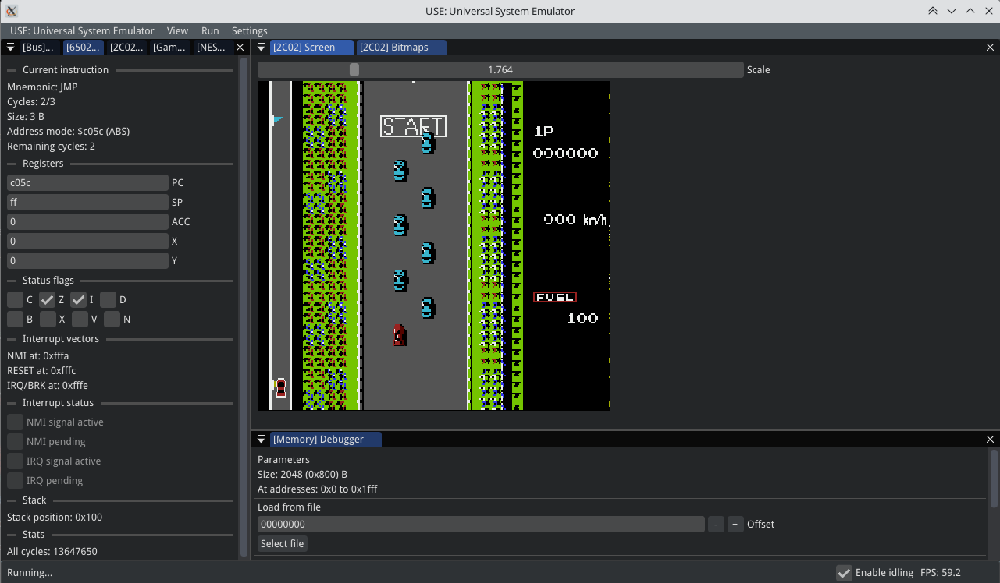
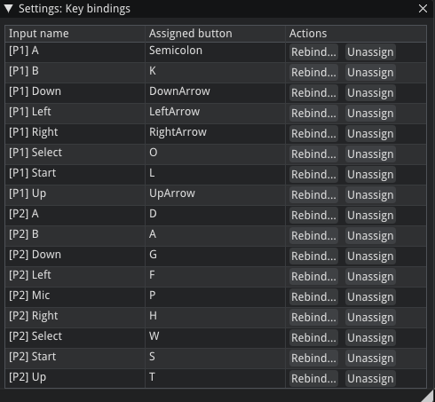

User Manual
#################

.. toctree::
   :maxdepth: 2
   :caption: Contents:

Introduction
*************

Welcome to the USE's user manual.
This page describes how to use the emulator for running
software on supported systems.

After you either built or aquired prebuilt application, you may run the executable.
You will be greeted by the main window:

In the bottom left, you can see current FPS value. Notice the "✅ Enable idling". If this is allowed,
no emulation is running and the application lost the focus (you clicked with the cursor elsewhere),
the application will reduce the target FPS to a lower value to reduce the CPU utilization.

At the top, there is a main menu with the following buttons:

* "USE: Universal System Emulator" acts like a "File" menu. You can select a system to emulate or quit the app.
* "View" menu allows to show/hide windows, select themes and toggle status bar and FPS display.
* "Run" menu is available only if the system is loaded and allows to control the state of the system.
* "Settings" menu allows to set up the emulator. For now there is no global setup, so it is available only when the system is loaded.

Trying out the first system: Running the NES
************************************************

One of the systems available in the Universal System Emulator is the Nintendo Entertainment System. Select it
from the main menu:

Multiple debugging windows will appear, the count of the windows and their contents depends on the system and used
components. In a case of the NES, there are debugging windows for every component. As a user, you will usually
want to just load a ROM and play the game.

Click the *[Gamepak] Parameters* window and under the *Load from file* click *Select file*. A file picker will be shown,
select a ROM dump from the filesystem.

.. note::
    Please be aware that only some of the ROMs are supported at the time of writing the documentation.
    There are many factors deciding whether or not the game of the software contained on the ROM will run well, mainly
    accuracy of the emulated hardware. However, the main factor is whether the "mapper" used by the cartridge which
    stored the software is supported by the emulator. For now, only mappers 0 and 1 are supported. See
    ``NesCartDB <https://nescartdb.com/>`` to check what mapper does the ROM dump use.

.. warning::
    Disclaimer: Do not forget that downloading and distribution of the ROM dumps is illegal.
    You have to own the physical cartridge and dump the ROM yourself to be able to legally run the software in any emulator.

When you select and open the ROM dump, you can run the software. At the top, select the *Run* menu and click *Run...*.
You will now see the video output and hear all the sounds generated by the console. You can also inspect some
of the other windows, they contain interesting information of the console's internal states.

To stop the emulation, click *Stop* in the same menu. To interact with the console, use your keyboard. To see
current key bindings, click the *Settings* menu and select *Key bindings*. You can change or unassign the keys using
the buttons in the *Actions* column.

That's it. 😄 Have fun and if you are interested in either platform's or specific system's development, head to
the :ref:`Developer's Guide`!